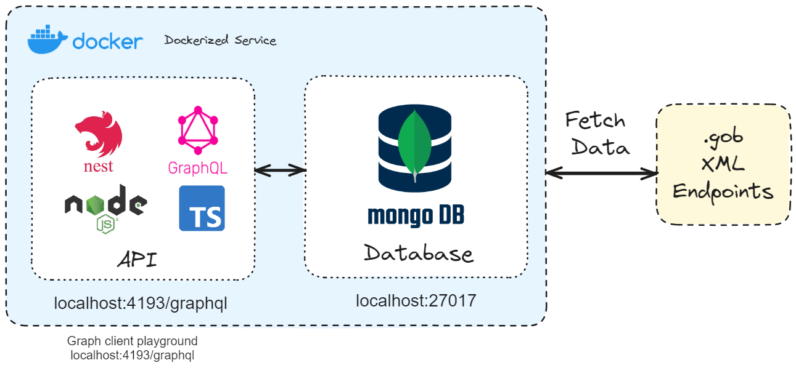

# Backend Challenge

Parse XML data, store the proccessed data, then read the data from the datastore



## Running the app

```bash
# Start containers
$ docker-compose up
```

## Fetch data from GraphQL playground

Access [(http://localhost:4193/graphql)](http://localhost:4193/graphql)

### Schema

```graphql
query queryNow($id: String!, $page: Int!) {
  getMake(id: $id) {
    makeId
    makeName
    vehicleTypes {
      typeId
      typeName
    }
  }

  getMakes(page: $page) {
    makeId
    makeName
    vehicleTypes {
      typeId
      typeName
    }
  }
}
```

### Query Variables

```json
{
  "id": "440",
  "page": 10
}
```

## Support

If you liked the repo, do not forget to give stars ✨✨✨
