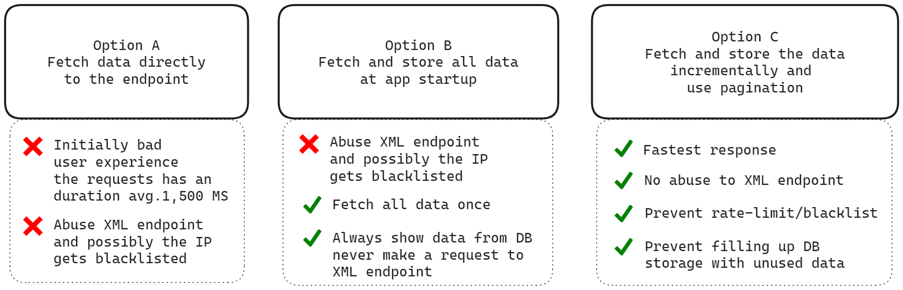

# Backend Challenge

[](https://sonarcloud.io/summary/new_code?id=ipr0310_node-transformer)

Parse XML data, store the proccessed data, then read the data from the datastore


## Running the app

```bash
# Start containers
$ docker-compose up
```

## Fetch data from GraphQL playground

Access [(http://localhost:4193/graphql)](http://localhost:4193/graphql)

## Challenge

### Data flow strategy



When i brainstormed multiple options for the data flow strategy of this service, i had 3 decisions:

**Variables:**

- There are more than 11,000 records of car makes
- Each car make has its own set of vehicle types

`The diagram above just shows in a easy way my explanation:`

- ### Option A

  Fetch data directly to the XML endpoint and show the response in JSON

  - **Benefits**:
    - Always get the latest data from endpoint, i think is not quite beneficial at all because there is no new car makes or vehicle types constantly
  - **Cons**:
    - The requests to the XML duration, specifically the getting all car makes has a very long duration
    - Get IP blacklisted and rate limited because the API will just be a proxy to the Endpoint
    - It's not what the client required, what was i thinking in the first place

- ### Option B

  Fetch all the `Car makes` with its `Vehicle types` and store it at app startup

  - **Benefits**:
    - Fetch the data to the XML endpoint once and never make another request
    - Always provide data from the `Database`

- - **Cons**:
    - Get IP blacklisted and rate limited because as there are thousand and thousands of records
    - The app startup will take minutes in order to get all data processed, stored and then provided to the user
    - Fill up DB storage with unused data

- ### Option C

Fetch the `Car makes` and `Vehicle types`, store it incrementally. And lastly, use pagination for getting all car mkes with its vehicly types

- **Benefits**:

  - Fastest response
  - Prevent abuse to XML endpoint
  - Prevent getting `rate-limited` `blacklisted`
  - Prevent filling up DB storage with unused data
  - Fetch incrementally once and the always provide data from the `Database`

- **Cons**:
  - Not get all car makes with its vehicle types in just one request

**The reason i picked the option C** is because is not viable to get all the car makes with its vehicle types in one request because of the following reason:

When querying all the car makes, there may be a car make without its vehicle types stored, which means a request is needed to the XML endpoint and it may be needed multiple times, its rate-limiting rules will block these requests. **Example**: the app makes hundreds of request to the endpoint, it will be rate-limited

#### TL;DR: I went with option C 🥸

## GraphQL

### Schema

```graphql
# There are 2 methods for fetching the make with its vehicle types
query queryNow($id: String!, $page: Int!) {
  # Get only one make
  getMake(id: $id) {
    makeId
    makeName
    vehicleTypes {
      typeId
      typeName
    }
  }

  # Get multiple makes
  getMakes(page: $page) {
    makeId
    makeName
    vehicleTypes {
      typeId
      typeName
    }
  }
}
```

### Query Variables

```json
{
  "id": "440",
  "page": 0
}
```

## Security advice 🔒

Never ever put secret keys on a repo, it does not matter if is private or public. I did this because this is a demo

## Support

If you liked the repo, do not forget to give stars ✨✨✨
